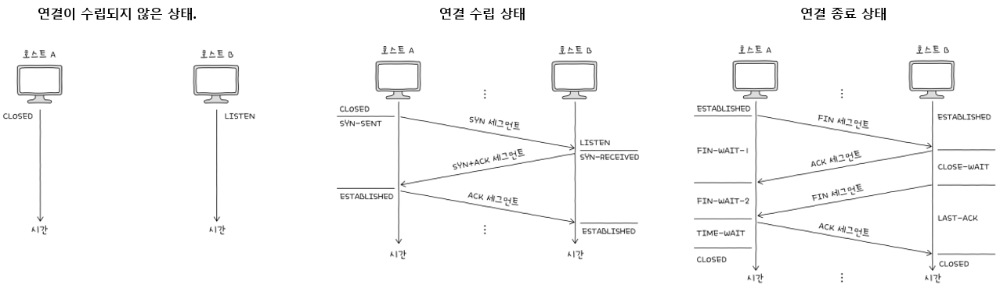

## 전송 개층

### 전송 계층 소개

- IP 대비 전송 계층의 보완점
  - 연결형 통신 지원 : TCP는 두 호스트가 정보를 주고받기 전에 마치 가상의 회선을 설정하듯이 연결을 수립함
  - 신뢰성 있는 통신 지원 : TCP는 패킷이 수신지까지 올바른 순서대로 확실히 전달되는 것을 보장함 (오류 제어, 흐름 제어, 혼잡 제어)

- 포트 : 응용 계층의 어플리케이션 프로세스를 식별하기 위한 정보
  - 잘 알려진 포트(0~1023), 등록된 포트(1024~49151), 동적 포트(49152~65535)가 있음
- NAPT, APT(Network Address Port Translation) : 포트 기반의 NAT, NAT 테이블에 변환될 IP 주소 쌍과 더불어 포트 번호도 함께 저장
- 포트 포워딩(port forwarding) : 네트워크 내 특정 호스트에 IP 주소와 포트 번호를 미리 할당하고, 해당 `IP 주소:포트 번호`로써 해당 호스트에게 패킷을 전달하는 기능

### TCP
- TCP(Transmission Control Protocol) : 신뢰할 수 있는 통신을 위한 연결형 프로토콜
  - MSS(Maximum Segment Size) : TCP로 전송할 수 있는 최대 페이로드의 크기
  - TCP 헤더 구성 : 송신지 포트, 수신지 포트, 순서 번호(세그먼트의 올바른 순서 보장), 확인 응답 번호(다음으로 수신하기를 기대하는 순서 번호), 제어 비트(ACK, SYN, FIN 비트), 윈도우(수신 윈도우 크기)
- 순서 번호(Sequence Number) : 세그먼트 올바른 송수신 순서를 보장하기 위한 번호, 세그먼트 데이터의 첫 바이트에 부여되는 번호
  - 초기 순서 번호 : 처음 연결을 수립할 때(SYN 플래그 = 1) 무작위로 설정
  - 데이터 송신 시: 연결 수립 후에는 송신한 바이트 수를 누적하여 더해가는 방식으로 값이 증가
- 확인 응답 번호(Acknowledgment Number) : 순서 번호에 대한 응답으로 수신 측이 다음으로 받기를 기대하는 순서 번호 (일반적으로 '수신한 순서 번호 + 1'로 설정)

- TCP 연결 수립 - 3-way Handshake
    | 송수신 방향 | 세그먼트 | 세그먼트에 포함된 중요 정보 |
    |:--:|:--:|--|
    |C -> S|SYN 세그먼트|- 클라이언트의 초기 순서 번호   - `SYN 비트 = 1` |
    |C <- S|SYN + ACK 세그먼트 |- 서버의 초기 순서 번호   - 클라이언트가 전송한 세그먼트에 대한 확인 응답 번호   - `SYN 비트 = 1`, `ACK 비트 = 1`|
    |C -> S|ACK 세그먼트|- 클라이언트의 다음 순서 번호   - 서버가 전송한 세그먼트에 대한 확인 응답 번호   - `ACK 비트 = 1`|

- TCP 연결 종료 - 4-way Handshake
    |송수신 방향|세그먼트|세그먼트에 포함된 중요 정보|
    |:--:|:--:|--|
    |C -> S|FIN 세그먼트|- `FIN 비트 = 1`|
    |C <- S|ACK 세그먼트|- 클라이언트 전송한 세그먼트에 대한 확인 응답 번호   - `ACK 비트 = 1`|
    |C <- S|FIN 세그먼트|- `FIN 비트 = 1`|
    |C -> S|ACK 세그먼트|- 서버가 전송한 세그먼트에 대한 확인 응답 번호   - `ACK 비트 = 1`|

- TCP 상태
  

### UDP
- UDP(User Datagram Protocol) : 비연결형 통신을 수행하는 신뢰할 수 없는 프로토콜, 스테이트리스 프로토콜의 일종
- UDP 데이터그램 헤더 : 송신지 포트, 수신지 포트, 길이, 체크섬으로 구성
  - 체크섬 : 데이터그램 전송 과정에서 오류가 발생했는지 검사하기 위한 필드, 수신지는 이 필드 값을 토대로 데이터그램의 정보가 훼손되었는지 판단함

### TCP의 제어 방법
