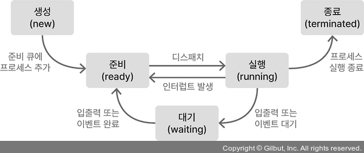

## 프로세스와 스레드

### 프로세스
- 실행되는 프로세스의 종류
  - 포그라운드 프로세스(foreground process) : 사용자가 볼 수 있는 공간에서 실행되는 프로세스
  - 백그라운드 프로세스(background process) : 사용자가 보지 못하는 뒷 공간에서 실행되는 프로세스
  - 데몬(demon) : 사용자와 상호작용하지 않고 정해진 일만 수행하는 백그라운드 프로세스

- PCB(Process Control Block, 프로세스 제어 블록) : 프로세스와 관련된 정보를 저장하는 자료 구조
  - 구성 : PID(프로세스 ID), 레지스터 값, 프로세스 상태, CPU 스케줄링 정보, 메모리 관리 정보, 사용한 파일과 입출력장치 목록
  - 운영체제는 커널 영역에서 PCB를 통해 여러 프로세스를 관리한다.

- 문맥(context) : 하나의 프로세스를 수행을 재개하기 위해 기억해야 할 정보
- 문맥 교환(context switching) : 기존 프로세스를 백업하고 (새로운 프로세스를 실행하기 위해 문맥을 PCB로부터 복구하여) 새로운 프로세스를 실행하는 것

- 프로세스의 메모리 영역
  - 코드 영역(텍스트 영역) : 실행할 수 있는 코드(기계어로 이루어진 명령어)가 저장되는 영역
  - 데이터 영역 : 프로그램이 실행되는 동안 유지할 데이터가 저장되는 공간 (ex. 전역 변수, ...)
  - 힙 영역 : 프로그램을 만드는 사용자가 직접 할당할 수 있는 저장 공간
  - 스택 영역 : 데이터를 일시적으로 저장하는 공간 (ex. 매개 변수, 지역 변수, ...)
  - 영역 별 특징 : 코드 영역과 데이터 영역은 프로그램이 실행되는 동안 크기가 고정되어 있어 정적 할당 영역이라 하고, 힙 영역과 스택 영역은 크기가 변할 수 있어 동적 할당 영역이라고 한다.

### 프로세스 상태와 계층 구조
- 프로세스 상태 종류
  - 생성 상태 : 프로세스가 생성 중인 상태
  - 준비 상태 : CPU에 처리되기를 기다리고 있는 상태
  - 실행 상태 : CPU를 할당 받아 실행중인 상태
  - 대기 상태 : 입출력장치의 작업을 기다리는 상태
  - 종료 상태 : 프로세스가 종료된 상태
- 프로세스 상태 다이어그램
  

- 프로세스 계층 구조
  - 프로세스는 실행 도중 시스템 호출을 통해 다른 프로세스를 생성할 수 있다. (트리 구조를 띄게 됨)
  - 부모 프로세스 : 새 프로세스를 생성한 프로세스
  - 자식 프로세스 : 부모 프로세스에 의해 생성된 프로세스
- 프로세스 생성 기법
  - fork : 부모 프로세스의 복제본을 자식 프로세스로 생성
  - exec : 자식 프로세스 자신의 메모리 공간을 다른 프로그램으로 교체

### 스레드
- 스레드 : 프로세스 내의 실행 흐름 단위
  - 프로세스 내 스레드들은 실행에 필요한 최소한의 정보만을 유지한 채 프로세스 내 자원을 공유함
  - 공유하는 영역 : 코드 영역, 데이터 영역, 힙 영역
  - 공유하지 않는 영역 : 스택 영역, PC 레지스터

- 멀티 프로세스(multiprocess) : 여러 프로세스를 동시에
- 멀티 스레드(multithread) : 여러 스레드로 프로세스를 동시에 실행시키는 것