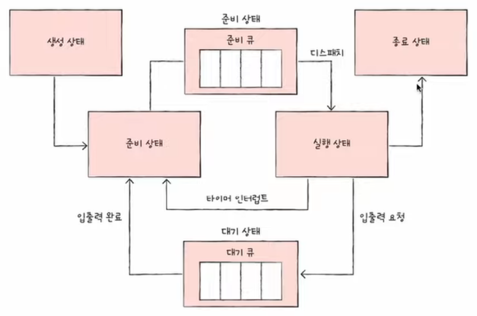

## CPU 스케줄링

### CPU 스케줄링 개요
- CPU 스케줄링 : 공정하고 합리적으로 CPU 자원을 배분하는 방법
  - 프로세스는 우선순위를 가지고 있고, 이는 PCB에 명시된다.
- CPU 스케줄링의 목적
  - 공평성 : 모든 프로세스가 자원을 공평하게 배정받아야 한다.
  - 효율성 : 시스템 자원이 유휴 시간 없이 사용되도록 스케줄링한다.
  - 안정성 : 우선순위를 사용하여 중요 프로세스가 먼저 작동하도록 배정한다.
  - 확장성 : 프로세스가 증가해도 시스템이 안정적으로 작동하도록 조치해야 한다.
  - 반응 시간 보장 : 시스템은 적절한 시간 안에 프로세스의 요구에 반응해야 한다.
  - 무한 연기 방지 : 특정 프로세스의 작업이 무한히 연기되어서는 안 된다.

- 준비 큐와 대기 큐
  

- 선점형 스케줄링과 비선점형 스케줄링
    | 구분 | 선점형 | 비선점형 |
    | --- | --- | --- |
    | 작업 방식 | 실행 상태에 있는 작업을 중단시키고 새로운 작업을 실행할 수 있다. | 실행 상태에 있는 작업이 완료될 때까지 다른 작업 실행이 불가능하다. |
    | 장점 | 프로세스가 CPU를 독점할 수 없어 대화형이나 시분할 시스템에 적합 | CPU 스케줄러의 작업량이 적고 문맥 교환의 오버헤드가 적다. |
    | 단점 | 문맥 교환의 오버헤드가 많다. | 기다리는 프로세스가 많아 처리율이 떨어진다. |
    | 사용 | 시분할 방식의 스케줄러에 사용 | 일괄 작업 방식 스케줄러에 사용 |
    | 중요도 | 높다 | 낮다 |

### CPU 스케줄링 알고리즘
- 비선점형 알고리즘
  - FCFS 스케줄링 (선입선출, First Come Fist Served) : 선입선출 스케줄링으로 한 번 실행되면 그 프로세스가 끝나야만 다음 프로세스를 실행할 수 있다.
    - 호위효과(convoy effect) : 아무리 짧은 테스크라도 긴 시간을 기다려야 한다.
  - SJF 스케줄링 (Shortest Job First) : 작업 우선 스케줄링으로 준비 큐에 있는 프로세스 중에서 실행 시간이 가장 짧은 작업부터 CPU를 할당한다.
    - 아사 현상(starvation) : 작업 시간이 길다는 이유로 작업이 계속 연기되는 현상
  - HRN 스케줄링 (Highest Response-ratio Next) : SJF 스케줄링에서 발생할 수 있는 아사 현상을 해결하기 위해 만들어졌다.
    - `우선 순위 = (대기 시간 + CPU 사용 시간) / CPU 사용 시간`

- 선점형 알고리즘
  - 라운드 로빈 스케줄링 : 타임 슬라이스 동안 작업을 하다가 작업을 완료하지 못하면 준비 큐의 맨 뒤로 가서 자기 차례를 기다리는 방식이다.
  - SRT 스케줄링(Shortest Remaining Time) : 기본적으로 라운드 로빈 스케줄링을 사용하지만, CPU를 할당받을 프로세스를 선택할 때 남아있는 작업 시간이 가장 적은 프로세스를 선택한다.
    - 아사 현상이 생길 수 있음
  - 다단계 큐 스케줄링 : 우선순위에 따라 준비 큐를 여러 개 사용하는 방식, 고정형 우선순위 사용
  - 다단계 피드백 큐 스케줄링 : CPU를 할당받아 실행될 때마다 프로세스의 우선순위를 낮춤
    - 낮은 우선순위에 큰 타임 슬라이스
    - 커널 프로세스는 일반 프로세스의 큐에 삽입되지 않음